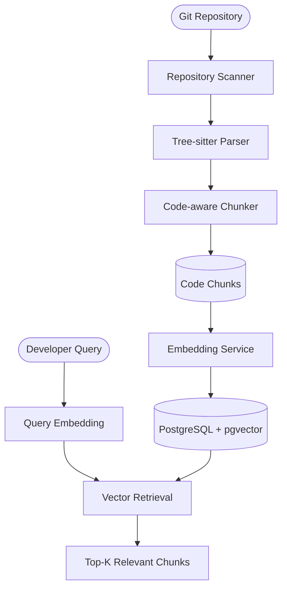

# 🧠 RepoIntel AI

A codebase intelligence platform for parsing, indexing, and semantically retrieving relevant context from software repositories.

RepoIntel transforms source repositories into structured representations using Tree-sitter parsing, code-aware chunking, local embeddings, and vector search.

---

## What it does

RepoIntel processes a repository through the following pipeline:

```text
Repository
    ↓
File Scanning
    ↓
AST Parsing
    ↓
Symbol Extraction
    ↓
Code-aware Chunking
    ↓
Embedding Generation
    ↓
pgvector / HNSW
    ↓
Semantic Retrieval
```

The current version focuses on building a reliable **repository-scoped retrieval system** that can serve as the foundation for future codebase intelligence and RAG capabilities.

---

## Architecture


---

## Key Components

**AST-aware parsing.** Tree-sitter is used to parse supported programming languages and extract meaningful code symbols such as classes, functions, and methods.

**Code-aware chunking.** AST-supported languages use symbol-aware chunks, while unsupported languages fall back to text-based chunking.

**Local embeddings.** Code chunks are embedded locally using `BAAI/bge-small-en-v1.5` with 384-dimensional vectors.

**Vector retrieval.** PostgreSQL with `pgvector` and HNSW provides approximate nearest-neighbor search.

**Repository isolation.** Retrieval is scoped to a specific repository so unrelated repositories do not contribute results.

**Retrieval evaluation.** The system includes an evaluation pipeline with Hit Rate@K, Recall@K, Precision@K, MRR, nDCG, and per-query failure analysis.

---

## Project Structure

```text
RepoIntel-AI/
│
├── backend/
│   ├── app/
│   │   ├── api/
│   │   ├── core/
│   │   ├── crud/
│   │   ├── models/
│   │   ├── schemas/
│   │   ├── services/
│   │   │   ├── repository/
│   │   │   ├── parsers/
│   │   │   ├── chunking/
│   │   │   ├── embedding/
│   │   │   ├── vector_store/
│   │   │   └── retrieval/
│   │   └── main.py
│   │
│   ├── alembic/
│   ├── benchmarks/
│   ├── tests/
│   ├── pyproject.toml
│   └── uv.lock
│
├── .gitignore
├── .python-version
└── README.md
```

---

## Tech Stack

- Python 3.12+
- FastAPI
- PostgreSQL
- pgvector
- HNSW
- SQLAlchemy 2
- Alembic
- Tree-sitter
- Sentence Transformers
- BAAI/bge-small-en-v1.5
- pytest
- uv

---

## Evaluation

Current V1 baseline:

| Metric | @1 | @3 | @5 |
|---|---:|---:|---:|
| Hit Rate | 0.375 | 0.875 | 1.000 |
| Recall | 0.229 | 0.708 | 0.917 |
| Precision | 0.375 | 0.375 | 0.300 |

**MRR@5:** 0.608

The baseline is kept frozen so future retrieval improvements can be measured against it.

---

## Getting Started

### Requirements

- Python 3.12+
- PostgreSQL with `pgvector`
- uv
- Git

### Installation

```bash
git clone https://github.com/AyushhVatsal/RepoIntel-AI.git
cd RepoIntel-AI/backend

uv sync
```

Configure the required environment variables in `.env`.

Run migrations:

```bash
uv run alembic upgrade head
```

Start the API:

```bash
uv run uvicorn app.main:app --reload
```

Run tests:

```bash
uv run pytest
```

---

## Current Status

- Repository ingestion ✅
- File scanning ✅
- Tree-sitter parsing ✅
- Symbol extraction ✅
- Code-aware chunking ✅
- Embedding pipeline ✅
- PostgreSQL + pgvector ✅
- HNSW indexing ✅
- Repository-scoped retrieval ✅
- Retrieval evaluation ✅

---

## Roadmap

- Hybrid retrieval
- Reranking
- Context pruning
- Dependency graphs
- Graph-enhanced retrieval
- Architecture analysis
- Repository-aware codebase chat

---

## License

License information will be added separately.
